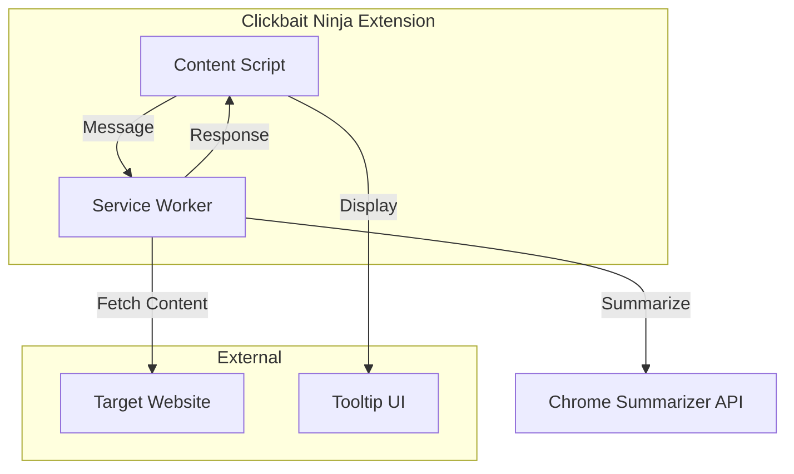

# Design Document: Clickbait Ninja Extension

## Overview

Clickbait Ninja is a Chrome extension that provides instant content summaries when users hover over links, helping them avoid clickbait and make informed decisions about which links to follow. The extension leverages Chrome's built-in Summarizer API (available from Chrome 138+) to generate concise summaries without requiring external API calls. The system uses a content script to detect hover events, a service worker to fetch and process content, and displays summaries in positioned tooltips.

## Architecture

The extension follows Chrome Manifest V3 architecture with three main components:



**Content Script**: Injected into web pages to detect link hover events and manage tooltip display
**Service Worker**: Background script that handles content fetching, summarization, and caching
**Tooltip UI**: Dynamic DOM element that displays summaries with proper positioning

## Components and Interfaces

### 1. Content Script (content.js)

**Responsibilities:**
- Detect hover events on valid links (anchor tags with HTTP/HTTPS URLs)
- Send summarization requests to service worker
- Manage tooltip creation, positioning, and removal
- Handle loading states and error display

**Key Functions:**
```typescript
interface ContentScript {
  initializeHoverListeners(): void;
  handleLinkHover(event: MouseEvent): void;
  handleLinkLeave(event: MouseEvent): void;
  sendSummaryRequest(url: string): Promise<SummaryResponse>;
  showTooltip(summary: string, position: Position): void;
  hideTooltip(): void;
  positionTooltip(mouseX: number, mouseY: number): Position;
}
```

### 2. Service Worker (background.js)

**Responsibilities:**
- Receive messages from content scripts
- Fetch webpage content using fetch API
- Process content through Chrome Summarizer API
- Manage caching and rate limiting
- Handle errors and fallbacks

**Key Functions:**
```typescript
interface ServiceWorker {
  handleMessage(message: Message): Promise<SummaryResponse>;
  fetchPageContent(url: string): Promise<string>;
  summarizeContent(content: string, url: string): Promise<string>;
  getCachedSummary(url: string): string | null;
  setCachedSummary(url: string, summary: string): void;
  cleanupCache(): void;
}
```

### 3. Summarizer Manager

**Responsibilities:**
- Initialize Chrome Summarizer API
- Configure summarization parameters
- Handle model download and availability
- Process content through summarizer

**Configuration:**
```typescript
const summarizerConfig = {
  type: 'tldr',           // Short, to-the-point summaries
  format: 'plain-text',   // Plain text for tooltip display
  length: 'long',         // Maximum 5 sentences as required
  sharedContext: 'This is a webpage that a user wants to preview before visiting'
};
```

## Data Models

### Message Interface
```typescript
interface SummaryRequest {
  type: 'SUMMARIZE_URL';
  url: string;
  timestamp: number;
}

interface SummaryResponse {
  success: boolean;
  summary?: string;
  error?: string;
  cached: boolean;
}
```

### Cache Entry
```typescript
interface CacheEntry {
  summary: string;
  timestamp: number;
  url: string;
}
```

### Tooltip Configuration
```typescript
interface TooltipConfig {
  maxWidth: number;      // 300px
  maxHeight: number;     // 200px
  padding: number;       // 12px
  borderRadius: number;  // 8px
  zIndex: number;        // 10000
  backgroundColor: string; // '#ffffff'
  borderColor: string;   // '#e0e0e0'
  textColor: string;     // '#333333'
}
```

## Correctness Properties

*A property is a characteristic or behavior that should hold true across all valid executions of a system-essentially, a formal statement about what the system should do. Properties serve as the bridge between human-readable specifications and machine-verifiable correctness guarantees.*

### Property 1: Hover Detection Timing
*For any* valid link element, when a hover event occurs, the system should detect and respond to the event within 100ms.
**Validates: Requirements 1.1**

### Property 2: Request Cancellation on Mouse Leave
*For any* active summary request, when the user moves their cursor away from the triggering link, the system should cancel the pending request.
**Validates: Requirements 1.2**

### Property 3: Valid Target Filtering
*For any* DOM element, the system should only respond to hover events on anchor tags with valid HTTP/HTTPS URLs, ignoring all other elements.
**Validates: Requirements 1.3, 1.4**

### Property 4: Content Fetch Timing
*For any* valid URL, when content fetching is initiated, the operation should complete (successfully or with error) within 3 seconds.
**Validates: Requirements 2.1**

### Property 5: Summary Length Constraint
*For any* successfully retrieved content, the generated summary should contain no more than 5 sentences, regardless of the original content length.
**Validates: Requirements 3.1, 3.2**

### Property 6: Language Preservation
*For any* non-English content, the summarizer should attempt to generate summaries in the same language as the original content.
**Validates: Requirements 3.4**

### Property 7: Tooltip Display Timing
*For any* completed summary, the tooltip should appear within 200ms of the summary being ready.
**Validates: Requirements 4.1**

### Property 8: Tooltip Hide Timing
*For any* displayed tooltip, when the user moves their cursor away from the link, the tooltip should disappear within 100ms.
**Validates: Requirements 4.2**

### Property 9: Viewport-Aware Positioning
*For any* tooltip that would extend beyond the viewport boundaries, the system should reposition it to remain fully visible within the viewport.
**Validates: Requirements 4.3**

### Property 10: Most Recent Summary Display
*For any* sequence of rapid hover events on different links, only the summary for the most recently hovered link should be displayed.
**Validates: Requirements 4.4**

### Property 11: Concurrent Request Limiting
*For any* series of hover events, the system should never have more than 3 concurrent content fetch requests active simultaneously.
**Validates: Requirements 5.1**

### Property 12: Cache Hit Behavior
*For any* URL that has been successfully summarized within the last 10 minutes, subsequent hover events on the same URL should return the cached summary without making new requests.
**Validates: Requirements 5.2**

### Property 13: Memory Management
*For any* cache state that exceeds 50MB, the system should automatically remove the oldest cached entries until memory usage is below the threshold.
**Validates: Requirements 5.3**

### Property 14: Navigation Cleanup
*For any* pending requests when a page navigation occurs, all requests from the previous page should be cancelled.
**Validates: Requirements 5.4**

### Property 15: Error Message Consistency
*For any* error condition (network failure, fetch failure, summarization failure), the system should display an appropriate error message and log the error details.
**Validates: Requirements 6.1, 6.2, 6.3, 6.4, 6.5**

### Property 16: Universal Script Injection
*For any* website visited, the extension should successfully inject content scripts to enable hover detection functionality.
**Validates: Requirements 7.2**

## Error Handling

### Network Errors
- **Connection Failures**: Display "Network error" message and retry with exponential backoff
- **Timeout Errors**: Cancel request after 3 seconds and show "Unable to load content"
- **CORS Restrictions**: Detect blocked requests and show "Content blocked by site"

### Content Processing Errors
- **Summarizer API Unavailable**: Fall back to showing page title or first paragraph
- **Model Download Required**: Show loading indicator during model download
- **Unsupported Content**: Detect media-only pages and show content type description

### Extension Errors
- **Permission Denied**: Request necessary permissions and guide user through setup
- **Script Injection Failure**: Log error and attempt re-injection on next page load
- **Memory Limits**: Implement cache cleanup and garbage collection

### Error Recovery Strategies
```typescript
interface ErrorHandler {
  handleNetworkError(error: NetworkError): Promise<void>;
  handleSummarizerError(error: SummarizerError): Promise<void>;
  handlePermissionError(error: PermissionError): Promise<void>;
  retryWithBackoff(operation: () => Promise<any>, maxRetries: number): Promise<any>;
}
```

## Testing Strategy

### Dual Testing Approach
The extension will use both unit tests and property-based tests to ensure comprehensive coverage:

**Unit Tests**: Verify specific examples, edge cases, and error conditions
- Test specific URL formats and validation
- Test tooltip positioning edge cases
- Test error message display for known failure scenarios
- Test cache expiration timing with specific timestamps
- Test extension lifecycle events (install, enable, disable)

**Property-Based Tests**: Verify universal properties across all inputs
- Generate random valid/invalid URLs to test filtering behavior
- Generate random content sizes to test summarization constraints
- Generate random mouse positions to test tooltip positioning
- Generate random timing sequences to test concurrent request limiting
- Generate random error conditions to test error handling consistency

### Property-Based Testing Configuration
- **Testing Library**: Use `fast-check` for JavaScript property-based testing
- **Test Iterations**: Minimum 100 iterations per property test
- **Test Tagging**: Each property test must reference its design document property
- **Tag Format**: `// Feature: link-hover-summary, Property {number}: {property_text}`

### Testing Environment Setup
```typescript
// Example property test structure
import fc from 'fast-check';

describe('Clickbait Ninja Properties', () => {
  it('should detect hover events within 100ms', () => {
    // Feature: link-hover-summary, Property 1: Hover Detection Timing
    fc.assert(fc.property(
      fc.webUrl(), // Generate random valid URLs
      async (url) => {
        const startTime = performance.now();
        const result = await simulateHover(url);
        const endTime = performance.now();
        expect(endTime - startTime).toBeLessThan(100);
      }
    ), { numRuns: 100 });
  });
});
```

### Integration Testing
- Test extension installation and initialization
- Test cross-origin content fetching with various websites
- Test Chrome Summarizer API integration and model download
- Test extension performance under heavy usage patterns
- Test compatibility with common websites and frameworks

### Manual Testing Scenarios
- Test on websites with different content types (articles, blogs, documentation)
- Test with slow network connections and offline scenarios
- Test accessibility with screen readers and keyboard navigation
- Test on different screen sizes and browser zoom levels
- Test extension updates and data migration